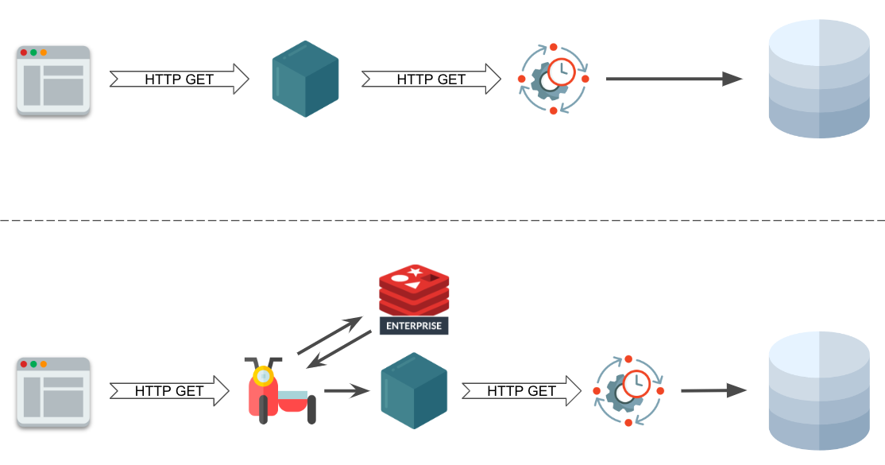

# Redis Sleight of hand

## Quick and dirty

First this:
```bash
docker-compose build
```
Next this:

```bash
docker-compose up
```
Done.

## Clean steps

### Introduction
You have a bunch of micro services that call a legacy system through a REST API to execute some heavy load on the database. Slow queires, so to speak.

The bad news is that you **cannot** touch the code.

The _good_ news is that you are on **kubernets**.

The goal is to speed up the operations, and in a normal scenario that would be leveraging a cache, such as Redis.

### Proposal
A hypothetical solution comes from the idea of implementing the Sidecar design pattern, and how this can be easily implemented in a containerized environment orchestrated by Kubernetes.

So the client application will call at the same original backend-endpoint a reverse proxy (Nginx), which first checks if the request has been cached into Redis, if so it returns the result immediately, otherwise the reverse proxy will forward the request to the real backend, which will contacnt the legasy REST API. Once the result from the backend has been obtained, it will be put into Redis (for the subsequent requests) and returned to the client application.

Easy peasy!

This is how the flow looks like:

<p align="center"></p>

### Implementation

The implementation consits of 2 main ciomponent, the OpenResty Nginx engine and its Lua Redis module.

#### OpenResty Nginx configuration file
```bash
error_log /dev/stdout debug;
access_log /dev/stdout;

log_format compression '$remote_addr - $remote_user [$time_local] '
                       '"$request" $status $body_bytes_sent '
                       '"$http_referer" "$http_user_agent" "$gzip_ratio"';

upstream appbackend {
    server backend:3000;
}

server {
    listen 80;

    add_header Access-Control-Allow-Origin *;

    location / {
        content_by_lua_file /etc/nginx/redis.lua;
    }

    location /backend {
        internal;
        rewrite ^/backend(/.*)$ $1 break;
        proxy_pass http://appbackend;
        proxy_set_header Host $host;
        proxy_set_header X-Real-IP $remote_addr;
        proxy_set_header X-Forwarded-For $proxy_add_x_forwarded_for;
        proxy_set_header X-Forwarded-Proto $scheme;
    }
}
```
#### Lua Redis configuration file
```lua
local redis = require "resty.redis"
local red = redis:new()

red:set_timeouts(1000, 1000, 1000) -- 1 sec

local ok, err = red:connect(ngx.var.host, 6379)
if not ok then
    ngx.log(ngx.ERR, "Error while connecting to Redis: ", err)
    return
end

local res, err = red:get(ngx.var.request_uri)
if res ~= ngx.null then
    -- Se presente in cache, servilo
    ngx.log(ngx.INFO, "Get the result directly from Redis cache.")
    ngx.print(res)
    return
end

ngx.log(ngx.INFO, "Request not present in Redis cache.")
res = ngx.location.capture("/backend" .. ngx.var.request_uri)

if res.status == 200 then
    local ok, err = red:setex(ngx.var.request_uri, 600, res.body)
    if not ok then
        ngx.log(ngx.ERR, "Houch, the request couldn't be cache into Redis: ", err)
    end
end

ngx.print(res.body)
```

## Conclusion
The client application can now benefit from a trasparent and additional layer which automatically caches the requests based on the uri.