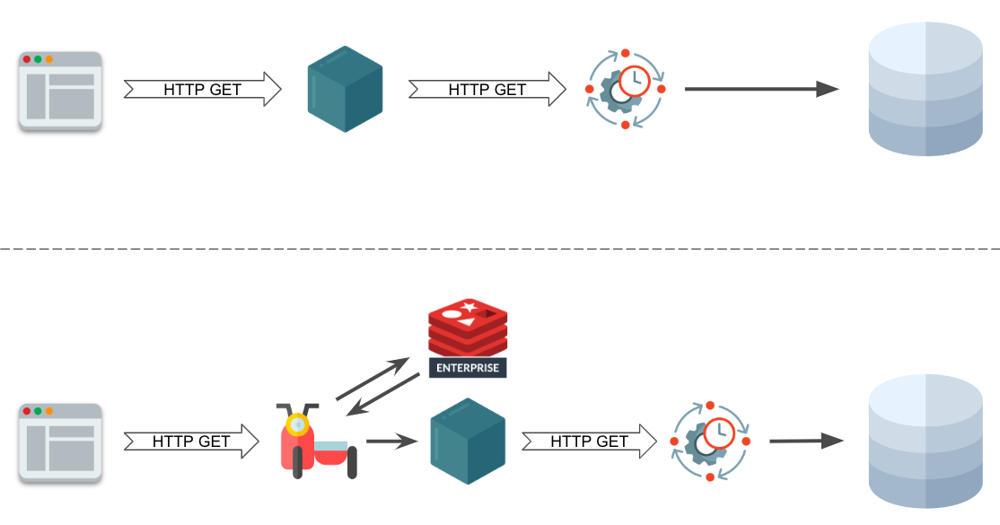

# Redis Sleight of Hand - Idempotency Gateway

## Quick Start

```bash
docker-compose build
docker-compose up
```

## Overview

### Introduction

The solution is to implement idempotency at the **infrastructure level** using a reverse proxy with Redis as an idempotency key store.

### The Problem
- Multiple identical requests can cause duplicate operations
- Application may not be modified to add idempotency
- Need a transparent solution that works across all services

### The Solution: Infrastructure-Level Idempotency
This project implements an **idempotency gateway** using OpenResty (Nginx + Lua) and Redis. The gateway acts as a sidecar that:

1. **Intercepts all requests** before they reach the backend
2. **Checks Redis** for existing idempotency keys
3. **Prevents duplicates** by returning an error if the request was already processed
4. **Allows new requests** to proceed to the backend and caches the idempotency key

### How It Works

<p align="center"></p>

#### Request Flow:
1. **First Request**: Check Redis → Key not found → Forward to backend → Cache idempotency key → Return response
2. **Duplicate Request**: Check Redis → Key found → Return 409 "Request already processed" error

### Implementation

The implementation consists of two main components: OpenResty Nginx engine and its Lua Redis module.

#### OpenResty Nginx Configuration
```nginx
error_log /dev/stdout debug;
access_log /dev/stdout;

log_format compression '$remote_addr - $remote_user [$time_local] '
                       '"$request" $status $body_bytes_sent '
                       '"$http_referer" "$http_user_agent" "$gzip_ratio"';

upstream appbackend {
    server backend:3000;
}

server {
    listen 80;

    add_header Access-Control-Allow-Origin *;

    location / {
        content_by_lua_file /etc/nginx/redis.lua;
    }

    location /backend {
        internal;
        rewrite ^/backend(/.*)$ $1 break;
        proxy_pass http://appbackend;
        proxy_set_header Host $host;
        proxy_set_header X-Real-IP $remote_addr;
        proxy_set_header X-Forwarded-For $proxy_add_x_forwarded_for;
        proxy_set_header X-Forwarded-Proto $scheme;
    }
}
```

#### Lua Idempotency Logic
```lua
local redis = require "resty.redis"
local red = redis:new()

red:set_timeouts(1000, 1000, 1000) -- 1 sec

-- Connect to Redis
local ok, err = red:connect('172.32.0.3', 6379)
if not ok then
    ngx.log(ngx.ERR, "Error while connecting to Redis: ", err)
    return
end

-- Check if the request has already been processed
local res, err = red:get(ngx.var.request_uri)
if res ~= ngx.null then
    -- If present in cache, return error
    ngx.log(ngx.INFO, "Request already processed by the backend.")
    ngx.status = 409  -- Conflict status code
    ngx.header.content_type = "application/json"
    ngx.print('{"error": "Request already processed by the backend.", "message": "The request has been already processed by the backend."}')
    return
end

-- If not in cache, proceed with the backend
ngx.log(ngx.INFO, "Request can be processed by the backend.")
res = ngx.location.capture("/backend" .. ngx.var.request_uri)

-- If the response is good, save the request (uri) as idempotency key
if res.status == 200 then
    local ok, err = red:setex(ngx.var.request_uri, 600, ngx.var.request_uri)
    if not ok then
        ngx.log(ngx.ERR, "Failed to save the request: ", err)
    end
end

-- Send the response to the client
ngx.print(res.body)
```

## Use Cases

### Perfect For:
- **Payment Processing**: Prevent duplicate charges
- **Order Creation**: Avoid duplicate orders
- **Resource Provisioning**: Prevent duplicate resource creation
- **API Endpoints**: Any operation that should only happen once

### Benefits:
- **Zero Application Changes**: Works transparently without modifying backend code
- **Infrastructure-Level Guarantee**: Idempotency enforced before requests reach the app
- **Distributed**: Works across multiple instances and services

## Configuration

### Idempotency Key Strategy
- **Default**: Uses the full request URI as the idempotency key
- **Customizable**: Can be modified to use specific headers, body content, or custom logic

### Error Responses
- **Status Code**: 409 Conflict
- **Format**: JSON with error message
- **Example**: `{"error": "Request already processed by the backend.", "message": "The request has been already processed by the backend."}`

## Conclusion
This solution provides **transparent idempotency** at the infrastructure level, ensuring that duplicate requests are safely rejected without requiring any changes to your application code. The gateway acts as a protective layer that prevents duplicate operations while allowing legitimate requests to proceed normally.